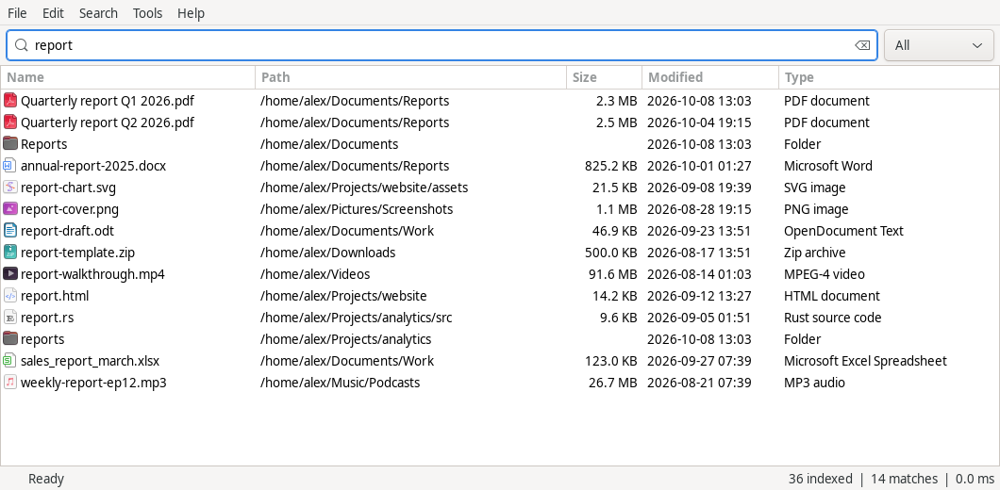

# File Minnow: a fast Everything alternative for Linux

**File Minnow is an instant file search app for Linux.** It works like
[Everything](https://www.voidtools.com/) on Windows: it indexes your file and folder
names once, keeps the index up to date in real time, and finds files **as you type**,
across millions of files, in milliseconds. It is a small native app written in Rust
with a compact GTK interface, a global hotkey and a tray icon.

If you have been looking for *"Everything for Linux"*, a faster `locate`, or a
lightweight desktop file search for Linux Mint, Ubuntu, Debian, Fedora, Arch or openSUSE,
File Minnow is built for exactly that.



## Why File Minnow

- **Instant results.** Searches over a 1.6-million-file index typically take
  10–50 ms. Results update on every keystroke.
- **Real-time index.** New, renamed and deleted files appear in the open results within
  a fraction of a second (Linux inotify). There is no hourly `updatedb` and no stale results.
- **Light on resources.** About 100 MB of memory for a 1.6-million-file index. It uses
  **0 % CPU when idle**, has no animations, and never polls in the background.
- **Familiar search syntax.** `AND`, `|` (OR), `!` (NOT), wildcards, `ext:`, `size:`,
  `dm:` (date modified), `path:`, `regex:`, and type filters like `pic:` and `doc:`.
- **Native desktop app.** It follows your GTK theme, fonts and file icons. Columns are
  sortable (name, path, size, date, type), and there is a type filter beside the search box.
- **The right-click menu you expect.** Open, Open With, Open Containing Folder, Open in
  Terminal, Cut/Copy (paste straight into your file manager), Rename, Move to Trash and
  Properties. It also shows your file manager's custom actions (Nemo actions, Thunar
  custom actions, Dolphin service menus, Nautilus and Caja scripts).
- **Global hotkey and tray icon.** Press your shortcut from anywhere and start typing.
  X11 is supported, and Wayland through the GlobalShortcuts portal.
- **Built for keyboard use.** Escape hides the window, Enter opens a file, F2 renames,
  Delete moves to the trash, and Ctrl+C copies the file.
- **Private and local.** No root, no network and no telemetry. It indexes only the
  folders you choose, with your own permissions.
- **Command line too.** Use `file-minnow search 'ext:pdf invoice'` in scripts, with
  NUL-safe output and exact Linux path bytes (non-UTF-8 names are preserved).

## Install

### Build from source

Install Rust (via [rustup](https://rustup.rs)) and the GTK 3 development files:

| Distribution | Command |
|---|---|
| Debian, Ubuntu, Linux Mint, Pop!_OS | `sudo apt install build-essential pkg-config libgtk-3-dev` |
| Fedora | `sudo dnf install gcc pkg-config gtk3-devel` |
| Arch, Manjaro, EndeavourOS | `sudo pacman -S --needed base-devel gtk3` |
| openSUSE | `sudo zypper install gcc pkg-config gtk3-devel` |

Then build and run:

```bash
git clone https://github.com/Puddings22/File-Minnow-Linux.git
cd File-Minnow-Linux
cargo build --release --locked
./target/release/file-minnow gui --root "$HOME"
```

The folders you index are saved, so later starts only need `file-minnow gui`.

### Debian package and portable archive

`scripts/package.py` builds a `.deb` (Debian, Ubuntu, Linux Mint) and a portable
`.tar.gz` for other glibc-based distributions. See [docs/install.md](docs/install.md) for
packaging, desktop integration, autostart and the optional background service.

## Using it

1. Start **File Minnow** and add folders with **File → Add Folder…** or
   **Tools → Options → Folders** (or pass `--root`). The status bar shows indexing
   progress. A large home folder takes seconds, not minutes.
2. Type. Results follow every keystroke; click a column header to sort.
3. Press the global shortcut (**Ctrl+Alt+Space** by default; change it in
   **Options → Keyboard**) from anywhere, type, and press Enter.

### Search syntax

| Search | Finds |
|---|---|
| `invoice` | names containing "invoice" |
| `invoice 2026` | both words (AND) |
| `report \| invoice pdf` | (report OR invoice) AND pdf: OR binds tighter, as in Everything |
| `<a b> \| c` | explicit grouping |
| `!draft` | names without "draft" |
| `"hello world"` | an exact phrase, including spaces |
| `*.pdf`, `IMG_????.jpg` | wildcards on the whole name |
| `ext:pdf;docx` | extensions |
| `pic:` `doc:` `audio:` `video:` `zip:` | common file types |
| `file:` / `folder:` | only files or only folders |
| `path:projects/src` | match against the full path |
| `case:README` | case-sensitive |
| `size:>100mb`, `size:1kb..2mb` | file size |
| `dm:today`, `dm:2026-10-07`, `dm:>2026-01-01` | date modified (local time) |
| `regex:"^report.*\.pdf$"` | regular expression (Rust syntax) |

More in the [user manual](docs/manual.md).

### Keyboard

| Key | Action |
|---|---|
| Your global shortcut | Show or hide File Minnow from anywhere |
| Ctrl+L | Focus the search box |
| ↓ / ↑ | Move into and through the results |
| Enter / Alt+Enter | Open / Properties |
| Ctrl+C / Ctrl+X | Copy / cut the selected files (paste in your file manager) |
| F2 / Delete | Rename / move to trash |
| Shift+F10 or Menu | Right-click menu |
| Ctrl+, | Options |
| F5 | Rescan |
| Escape | Hide the window (to the tray) |

## Everything vs. File Minnow: FAQ

**Is there a version of Everything for Linux?**
voidtools Everything is Windows-only. File Minnow is an independent Linux app with the same
idea: an instant filename index with Everything-style search syntax, a global hotkey
and a tray icon.

**How is it different from `locate` / `plocate`?**
`locate` reads a database refreshed by `updatedb`, often daily, so new files are missing.
File Minnow watches your folders and updates instantly. It also has a desktop UI with
sorting, a type filter and file actions.

**Does it search inside files?**
No. Like Everything, it searches file and folder **names** and paths, which is why it is
so fast.

**Does it need root, or does it index the whole disk?**
No root. It indexes only the folders you add, with your own permissions. Pseudo
filesystems (`/proc`, `/sys`, `/dev`, `/run`) are always skipped.

**Which desktops does it work on?**
Any Linux desktop with GTK 3: Cinnamon (primary test desktop), GNOME, KDE Plasma, Xfce,
MATE, Budgie and others. The global hotkey and the tray work on X11. On Wayland the
hotkey uses the GlobalShortcuts portal where the compositor provides it, and the tray
needs a StatusNotifierItem host. Window show and hide on Wayland is still being
improved.

**How much memory does it use?**
Roughly 60–70 bytes per indexed entry plus the GTK window. For 1.6 million files that
is about 100 MB of index and about 170 MB for the whole app.
See [docs/performance.md](docs/performance.md).

## Status

File Minnow is young (0.x). It is used daily on Linux Mint Cinnamon. Not yet
available: file-content search, recursive folder sizes, search history and bookmarks in
the UI, and network-share indexing beyond what a mounted folder offers. Bug reports and
pull requests are welcome.

## Development

```bash
cargo fmt --all -- --check
cargo clippy --locked --all-targets -- -D warnings
cargo test --locked --all-targets
cargo build --locked --no-default-features   # CLI and daemon without GTK
```

Without system GTK development packages, `scripts/with-gtk-sdk.sh cargo build` can use an
extracted SDK in `.dev/gtk-sdk`. The desktop integration tests run on a private X server
and D-Bus session and never touch your desktop:
`python3 scripts/test_ui.py --xvfb /path/to/Xvfb [--tray] [--portal] [--daemon-first]` and
`python3 scripts/test_focus.py --xvfb /path/to/Xvfb` (runs Muffin inside Xvfb). See
[CONTRIBUTING.md](CONTRIBUTING.md).

## License

MIT. See [LICENSE](LICENSE).

File Minnow is an independent project and is not affiliated with or endorsed by voidtools.
"Everything" is the name of voidtools' Windows search tool. It is mentioned here only to
describe what File Minnow is similar to.
